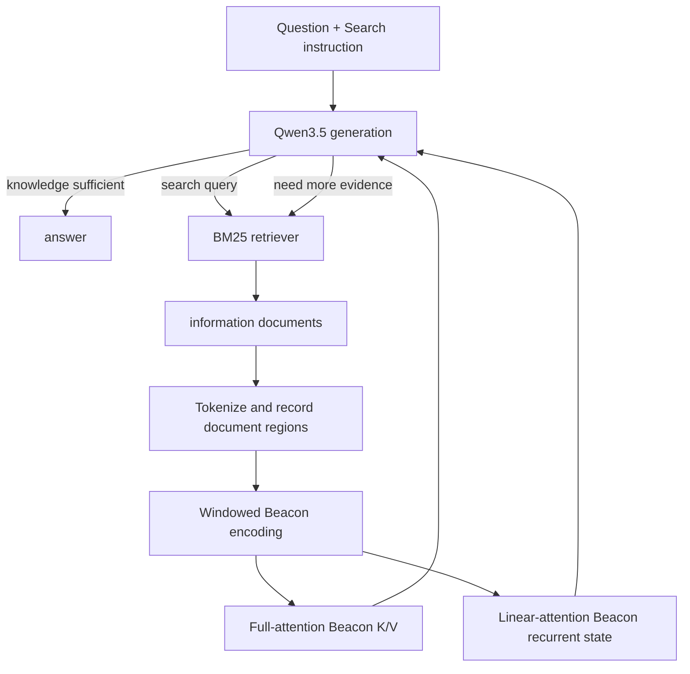

# SearchAgent 与 Activation Beacon 的 Qwen3.5 混合压缩方法

本文档描述截至 **2026-09-11** 当前代码中的真实实现，而不是仅描述概念设计。
核心代码位于：

- `search_comp/data/trajectory.py`：SearchAgent 协议与轨迹 token 区间构造；
- `search_comp/data/searchr1_dataset.py`：Search-R1 messages 数据解析；
- `search_comp/evaluation/beacon_interactive_eval.py`：在线搜索循环；
- `search_comp/models/beacon_qwen3.py`：Qwen3.5 混合层 Beacon 压缩；
- `search_comp/trainer/beacon_trainer.py`：标准 Trainer 训练入口。

本项目不是 Activation Beacon 论文官方实现的逐行复刻，而是面向 Qwen3.5
`full_attention + linear_attention` 混合架构的适配。最重要的额外问题是：除了标准
attention K/V cache，Qwen3.5 的 GatedDeltaNet 线性注意力层还携带 recurrent state 和
causal-convolution state。若只删除 K/V 而保留这些状态，原始检索文档仍可绕过 Beacon
影响后续生成。因此，本实现对两类层分别定义了严格的压缩边界。

---

## 1. 方法目标

系统需要同时满足四个目标：

1. 模型遵循 SearchAgent 指令，在缺少知识时生成 `<search>query</search>`；
2. 外部检索器返回 `<information>documents</information>`；
3. 模型读取文档后继续推理，必要时再次搜索，最终生成 `<answer>...</answer>`；
4. 文档被读取一次后，后续生成不再直接依赖完整文档 token 状态，而只依赖压缩载体。

这里的“压缩载体”由两部分组成：

- full-attention 层：每个文档窗口对应的 Beacon K/V；
- linear-attention 层：仅由 Beacon 激活写入的固定尺寸 recurrent state。

原始文档 token 仍必须在压缩阶段被模型读取。该方法减少的是文档读取后的持续上下文
开销，尤其是后续 full-attention 层对历史 K/V 的访问，而不是消除首次文档编码成本。

---

## 2. 总体系统结构



Qwen3.5-2B 的文本主干是混合 decoder：当前模型配置中 24 层里有 6 层
`full_attention`，其余 18 层为 `linear_attention`。每个 decoder layer 都保持标准
residual 与 MLP 结构，但 attention 子层的记忆形式不同：

```text
full_attention:
    token history -> K/V sequence cache -> cache length grows with context

linear_attention / GatedDeltaNet:
    token history -> recurrent matrix state + short convolution state
                  -> state shape is fixed, but content still includes history
```

固定尺寸只代表内存不会随长度增长，并不代表原始文档已经经过 Beacon 压缩。为此，系统
不能直接把 HuggingFace `DynamicCache` 从文档窗口传到后续生成。

---

## 3. SearchAgent 交互协议

### 3.1 初始提示

`build_search_chat_prompt()` 手动构造 ChatML：

```text
<|im_start|>system
Answer the given question. ...
<|im_end|>
<|im_start|>user
{question}<|im_end|>
<|im_start|>assistant
```

搜索协议完整位于 system 消息；首个 user 消息只包含问题本身，不再重复行为说明或
`Question:` 前缀。指令要求模型：

- 每次收到新信息先在 `<thinking>...</thinking>` 中推理；
- 缺少知识时生成 `<search>...</search>`；
- 搜索结果由环境写入 `<information>...</information>`；
- 信息足够时生成 `<answer>...</answer>`。

训练数据中实际常见的推理标签是 `<think>...</think>`。当前代码保留了已有数据协议，
因此模型主要通过 SFT 轨迹学习标签使用方式，而不是依赖 tokenizer 自动插入空思考块。

### 3.2 一轮搜索

一次完整搜索轮次的逻辑序列是：

```text
model:
    <think>reasoning</think>
    <search>query</search>

environment:
    <information>retrieved documents</information>

model:
    <think>reason over new evidence</think>
    ...
```

在线评测时，系统执行以下步骤：

1. 调用 `beacon_generate()`，遇到 `</search>` 或 `</answer>` 停止；
2. 若生成了 `</search>`，用正则提取最后一个 query；
3. BM25 检索 top-k 文档；
4. 把文档格式化并限制到 `max_docs_tokens`；
5. 将信息标签、文档 token 和结束标签追加到 `context_ids`；
6. 仅把标签内部的文档 token 区间加入 `regions`；
7. 再次调用模型，使所有已知 `<information>` 区间经过 Beacon 压缩。

注意：`<information>` 和 `</information>` 标签本身属于 keep token。这样模型仍能明确
感知环境消息边界，而标签内部可能很长的文档内容被压缩。

---

## 4. 训练序列如何构造

### 4.1 片段类型

训练轨迹先被拆成四类片段：

| 类型 | 示例 | 是否压缩 | 是否计算 loss |
| --- | --- | --- | --- |
| `gen` | think、search、answer | 否 | 是 |
| `info_prefix` | `<information>` | 否 | 否 |
| `docs` | 检索文档正文 | 是 | 否 |
| `info_suffix` | `</information>` | 否 | 否 |

对于两轮搜索样本，逻辑结构近似为：

```text
[system + user + assistant-prefix]                  keep, no loss
[think_1 + search_1]                                keep, loss
[information-prefix]                               keep, no loss
[documents_1]                                      compress, no loss
[information-suffix]                               keep, no loss
[think_2 + search_2]                                keep, loss
[information-prefix]                               keep, no loss
[documents_2]                                      compress, no loss
[information-suffix]                               keep, no loss
[final-think + answer]                             keep, loss
```

### 4.2 逐片段 tokenize

代码不是先拼接完整字符串再反向猜测字符位置，而是对每个片段单独 tokenize，然后按
token 数更新游标。设拼接后的 token 序列为：

```text
x = [x_0, x_1, ..., x_(L-1)]
```

每个文档片段记录半开区间：

```text
R_j = [start_j, end_j)
```

所有 `R_j` 构成 `regions`。每个模型生成片段另行记录 `gen_spans`。因此压缩边界与
loss 边界都在 token 空间定义，不依赖字符长度。

### 4.3 loss mask

初始 labels 全部设为 `-100`，只在 `gen_spans` 中复制真实 token id：

```text
labels_i = x_i       if i belongs to a generated span
labels_i = -100      otherwise
```

进入 Beacon 状态机后，labels 会全局左移一位：

```text
shifted_labels_i = labels_(i+1)
```

这是因为当前位置 logits 用于预测下一个 token。全局预移位而不是每个窗口单独移位，
保证跨窗口边界的 next-token 监督仍然正确。文档、环境标签和 Beacon token 均为
`-100`，不会直接贡献交叉熵。

文档虽然没有 token-level loss，但其激活参与 Beacon 构造。后续 answer loss 可以通过
Beacon K/V 和 Beacon recurrent state 反向传播到压缩模块。

当前训练实现还会先筛选 `labels != -100` 的位置，只为这些监督 token 执行 LM head。
监督位置再按 `beacon_loss_chunk_size` 分块；开启 `beacon_checkpoint_loss` 后，完整词表
logits 不保留到 backward，而是在反向阶段逐块重算。全为 `-100` 的文档/Beacon 窗口
完全不执行 LM head。这不改变交叉熵定义，只消除无监督位置的巨型词表张量。

---

## 5. 从 regions 到窗口状态机

### 5.1 keep/compress 分段

给定多个文档区间：

```text
regions = [(s_1, e_1), (s_2, e_2), ...]
```

`_Qwen3BeaconMemory.prepare()` 将整条序列转换为：

```text
[(0, s_1, keep),
 (s_1, e_1, compress),
 (e_1, s_2, keep),
 (s_2, e_2, compress),
 ...]
```

keep 和 compress 段都按 `beacon_window` 切块。当前实现是 append 模式且没有重叠，
因此配置时应保持：

```text
beacon_stride == beacon_window
```

### 5.2 Beacon 数量

设当前压缩窗口原始文档长度为 `D`，压缩率为 `r = beacon_ratio`，则 Beacon 数量：

```text
B = D / r                         if D is a full window
B = ceil(D / r), at least 1       if D is the final partial window
```

窗口输入从：

```text
[d_1, d_2, ..., d_D]
```

扩展为：

```text
[d_1, d_2, ..., d_D, b_1, b_2, ..., b_B]
```

Beacon 使用虚拟 token id `vocab_size`。该 id 不进入原始 embedding table，而由专门的
`beacon_embed_tokens` 映射。Beacon embedding 初始化自 EOS embedding，之后可训练。

`_step_beacon_indices` 同步记录每个位置是普通 token 还是 Beacon：

```text
[0, 0, ..., 0, 1, 1, ..., 1]
```

### 5.3 因果可见性

Beacon 追加在窗口尾部，因此标准 causal mask 自动产生需要的读取关系：

- 文档 token 看不到未来 Beacon；
- Beacon 可以看到当前窗口全部文档 token；
- 后一个 Beacon 可以看到前一个 Beacon；
- 当前窗口所有 token 可以看到已提交的历史 keep/Beacon memory。

这就是当前 `full-coverage` 的含义。多个 Beacon 不是各自硬绑定到互斥文档分片，而是
通过位置、因果顺序、隐藏状态和可训练投影学习不同的压缩表示。

---

## 6. 一个 decoder layer 内发生什么

对第 `l` 层输入隐藏状态 `H_l`，标准 decoder 结构仍为：

```text
U_l = H_l + Attention_l(LN(H_l))
H_(l+1) = U_l + MLP_l(PostLN(U_l))
```

差异只在 `Attention_l` 和跨窗口 memory commit。

---

## 7. Full-attention 层的 Beacon 压缩

### 7.1 普通 token 与 Beacon 使用不同投影

普通 token 使用预训练 Qwen3.5 投影：

```text
Q_o = W_q H
K_o = W_k H
V_o = W_v H
```

Beacon 位置可切换到独立可训练投影：

```text
Q_b = W_q^b H
K_b = W_k^b H
V_b = W_v^b H
```

实际使用 `torch.where(beacon_index, beacon_projection, original_projection)` 在 token 级别
切换。`beacon_param` 决定 q/k/v/o 中哪些投影独立。默认是 `q k v`。

Beacon 投影初始化为对应原始投影，使训练从接近原模型行为的起点开始，而不是从全零
attention 开始。

Qwen3.5 的 query projection 同时包含 attention query 和输出 gate：

```text
[Q, G] = split(W_q H)
AttentionOutput = SDPA(Q, K, V) * sigmoid(G)
```

Beacon q projection保持相同输出宽度，因此 gate 也随 Beacon 投影一起切换。

### 7.2 RoPE 前缓存

持久 full-attention cache 保存 RoPE 之前的 K/V。每个窗口执行时：

1. 拼接历史持久 K/V 与当前窗口增量 K/V；
2. 根据压缩后 cache 长度构建全局位置；
3. 对拼接后的全部 key 重新施加 mRoPE；
4. query 只使用当前窗口末尾对应的位置编码；
5. 执行 causal attention。

这种实现使删除原始文档 K/V 后，剩余 keep token 与 Beacon token 可以在压缩后的连续
位置空间中重新编码。这里维持的是“压缩后记忆序列的位置”，不是原始文档每个 token
的绝对位置。

### 7.3 窗口提交

full-attention 层产生当前窗口全部 token 的增量 K/V：

```text
K_new = [K_doc, K_beacon]
V_new = [V_doc, V_beacon]
```

若当前段是 keep：

```text
K_memory <- concat(K_memory, K_new)
V_memory <- concat(V_memory, V_new)
```

若当前段是 compress：

```text
K_memory <- concat(K_memory, select_beacon(K_new))
V_memory <- concat(V_memory, select_beacon(V_new))
```

因此原始文档 K/V 只在当前压缩窗口内部存在；窗口结束后不会进入持久 cache。

---

## 8. Linear-attention 层为何不能直接保留原生状态

### 8.1 GatedDeltaNet 的状态

Qwen3.5 linear-attention 层不是无状态映射。它包含：

1. causal convolution 的短期输入状态；
2. GatedDeltaNet recurrent matrix state。

抽象地，原生 recurrent 更新可写为：

```text
S_t = decay_t * S_(t-1)
prediction_t = S_(t-1)^T k_t
error_t = v_t - prediction_t
S_t = S_t + beta_t * k_t * error_t^T
```

即使 `S_t` 的 shape 固定，它仍然是所有历史 token 的内容函数。如果文档窗口结束后直接
保留原生 `S_t`，后续 token 就能从该状态访问原始文档影响，而无需经过 Beacon。

这会形成以下旁路：

```text
documents -> original DeltaNet state -> later answer
          \-> Beacon representation -> later answer
```

此时删除 full-attention K/V 不能证明信息只通过 Beacon 传播。

### 8.2 本实现的边界原则

压缩窗口内允许原始线性状态存在，因为 Beacon 必须读取文档；但该状态被定义为临时
reader state，不允许跨越压缩边界。

```text
before window:
    persistent recurrent state S_prev
    optional keep-only convolution state C_prev

inside compressed window:
    temporary reader state S_reader
    temporary convolution state C_reader

after commit:
    discard S_reader
    discard C_reader
    persistent state = Writer(beacon hidden states, S_prev)
```

关键点是 writer 的 previous state 是压缩窗口进入前的 `S_prev`，不是已经吸收原始文档
的 `S_reader`。

---

## 9. 显式 GatedDeltaNet reader 前向

为了精确控制状态提交，代码不再让 HuggingFace `DynamicCache` 隐式跨窗口修改状态，而是
在 `_linear_attention_forward()` 中显式计算：

### 9.1 Q/K/V 卷积输入

```text
P = in_proj_qkv(H)
```

如果前一段存在合法 keep convolution state，则将其作为 causal conv 左上下文：

```text
P_context = concat(C_prev, P)
Mixed = SiLU(DepthwiseCausalConv(P_context))
```

只保留对应当前窗口长度的卷积输出，并记录最后 `conv_kernel_size` 个 projected inputs
作为临时 `C_reader`。

### 9.2 DeltaNet 参数

卷积输出被拆为 query、key、value：

```text
[Q, K, V] = split(Mixed)
beta = sigmoid(in_proj_b(H))
g = -exp(A_log) * softplus(in_proj_a(H) + dt_bias)
```

然后调用 Qwen3.5 的 chunk gated-delta-rule，以 `S_prev` 为 initial state：

```text
[O, S_reader] = GatedDeltaRule(Q, K, V, g, beta, initial_state=S_prev)
```

输出再经过 gated RMS norm 和 `out_proj`，进入 decoder residual/MLP。这样 Beacon hidden
state 能在窗口内读取文档，同时状态所有权仍由本项目控制。

---

## 10. BeaconLinearStateWriter

### 10.1 writer 输入

在第 `l` 个 linear-attention layer 完成 attention residual 和 MLP 后，取该层 Beacon
位置的输出隐藏状态：

```text
B_l = H_(l+1)[beacon_positions]
```

这些隐藏状态已经融合：

- 当前文档窗口；
- 历史 keep/Beacon memory；
- 当前层之前所有 decoder layer 的变换；
- 当前 linear layer 的临时 reader 输出；
- 当前 layer MLP。

因此 writer 不需要直接读取原始 token state，只读取经过 decoder 形成的 Beacon 激活。

### 10.2 低秩参数化

writer 首先执行：

```text
Z = Up(SiLU(Down(LayerNorm(B_l))))
```

其中 `Down: hidden_size -> writer_rank`，`Up` 输出每个 value head 对应的：

```text
[writer_key, writer_value, writer_decay, writer_beta]
```

`beacon_linear_writer_rank` 控制额外参数与表达能力。

### 10.3 writer 状态更新

对每个 Beacon `b` 顺序执行：

```text
k_b = L2Normalize(writer_key_b)
v_b = writer_value_b
d_b = sigmoid(writer_decay_b)
beta_b = sigmoid(writer_beta_b)

S <- d_b * S
p_b = S^T k_b
u_b = beta_b * (v_b - p_b)
S <- S + k_b * u_b^T
```

初始 `S` 是压缩窗口进入前的持久 recurrent state；若不存在则是全零状态。最终
`S` 成为该 linear layer 新的持久状态。

writer 使用 FP32 维护 recurrent 更新，降低长序列状态累积的数值风险；返回状态可在后续
Qwen3.5 linear-attention 计算中作为 initial state 使用。

### 10.4 convolution state 的处理

compress 窗口结束后：

```text
linear_recurrent[layer] = writer_state
delete linear_conv[layer]
```

不尝试从 Beacon 重建 convolution state。原因是 convolution state 直接包含最近若干个
projected token，若保留压缩窗口尾部状态，就会明确残留原始文档或 Beacon 前邻 token。

下一段从零卷积左上下文开始，但仍能通过 writer recurrent state 和 full-attention Beacon
K/V 使用压缩记忆。这是为了保证严格边界而接受的局部连续性折中。

keep 窗口则不同：其 token 本来就允许被完整保留，因此 reader recurrent state 与
convolution state 都直接提交。

---

## 11. 每个压缩窗口的完整逐层过程

设当前窗口包含 `D` 个文档 token 和 `B` 个 Beacon。一次 `_native_forward()` 的过程为：

```text
1. Embedding
   document ids -> original token embedding
   beacon virtual ids -> beacon embedding

2. For layer l = 1 ... N
   a. input layer norm

   b1. if full_attention:
       project ordinary/beacon QKV separately
       concatenate persistent compressed K/V
       apply mRoPE and causal attention
       retain current incremental K/V temporarily

   b2. if linear_attention:
       read persistent recurrent/conv state
       run explicit causal conv + GatedDeltaNet reader
       obtain temporary reader recurrent/conv state

   c. attention residual
   d. post-attention norm + MLP residual

   e. if linear_attention and current window is compress:
       select beacon hidden states after this layer
       writer(beacon hidden, pre-window persistent state)
       commit writer recurrent state
       discard temporary conv state

   f. if linear_attention and current window is keep:
       commit native reader recurrent and conv states

3. final model norm + LM head

4. full_attention memory commit
   compress: append only Beacon K/V
   keep: append all current K/V

5. loss accumulation
   only shifted labels != -100 contribute
```

linear writer 在每个 linear layer 内立即提交该层状态，但 full-attention K/V 在整个模型
窗口前向完成后由 memory state machine 统一选择并追加。

---

## 12. 压缩边界后的严格不变量

对任意已经完成的 `<information>` 压缩窗口，持久 memory 必须满足：

```text
M_persistent = {
    full_attention: Beacon K/V only,
    linear_attention: writer recurrent state only,
    convolution: no state from the compressed window
}
```

不存在以下对象：

- 文档 token 的 full-attention K/V；
- 文档窗口产生的原生 GatedDeltaNet final state；
- 文档窗口尾部的 causal-convolution state；
- HuggingFace `DynamicCache` 形式的隐藏旁路。

因此从压缩窗口到后续答案的计算图只能经过：

```text
documents
   -> Beacon hidden activations
      -> full-attention Beacon K/V
      -> linear Beacon writer recurrent state
         -> later reasoning / search / answer
```

这是本实现针对审稿质疑最重要的结构性论据。它不是通过“状态大小固定”推断没有泄漏，
而是通过代码级 memory ownership 和边界替换保证原始状态不被提交。

---

## 13. 训练时梯度如何传播

### 13.1 直接监督路径

交叉熵只监督模型应生成的内容：

```text
L = CE(predicted think/search/answer tokens, target tokens)
```

文档 token 和 Beacon token 没有直接 LM loss。

### 13.2 压缩学习路径

假设 answer token 的预测依赖前面文档，则梯度路径包括：

```text
answer loss
  -> later decoder hidden states
  -> compressed full-attention K/V
  -> Beacon full-attention projections
  -> Beacon hidden states
  -> document reader activations
```

以及：

```text
answer loss
  -> later linear-attention output
  -> persistent writer recurrent state
  -> BeaconLinearStateWriter
  -> Beacon hidden states
  -> document reader activations
```

因此 Beacon 表示学习的是“对后续 reasoning/search/answer 有用的信息”，而不是重建全部
文档文本。

### 13.3 可训练参数

不使用 LoRA 时，基础模型与 Beacon 参数都可以参与训练。使用 LoRA 时：

- 基础模型主体被冻结；
- q/k/v/o、MLP 等目标模块使用 LoRA；
- 名称包含 `beacon` 的参数被重新设为 `requires_grad=True`；
- Beacon embedding、Beacon attention projections、linear-state writers 全量训练。

测试 `test_linear_writer_receives_gradient_from_post_compression_tokens` 验证了压缩后 token
的 loss 能到达 linear writer。

---

## 14. 推理时的 prefill 与 decode

### 14.1 prefill

`prefill_and_get_cache(input_ids, regions)` 对当前完整上下文执行窗口状态机：

```text
question / instruction / generated reasoning     -> keep
information document bodies                     -> compress
information tags                                -> keep
```

prefill 结束后得到：

- 每个 full-attention layer 的压缩 K/V；
- 每个 linear-attention layer 的 persistent recurrent state；
- 若上下文最后是 keep token，还会有对应的合法 keep convolution state；
- 最后位置对下一个 token 的 logits。

### 14.2 单 token decode

每生成一个 token：

1. full-attention query 访问压缩后的历史 K/V；
2. linear attention 从 persistent recurrent/conv state 更新一步；
3. 新 token 属于模型生成内容，按 keep 策略提交；
4. full-attention cache 追加该 token K/V；
5. linear recurrent 和 convolution state 更新为新状态。

生成直到 EOS、`</search>`、`</answer>` 或 `max_new_tokens`。

### 14.3 多轮搜索的当前实现边界

当前在线 Agent 每得到一批新搜索结果后，会把新 `<information>` 追加到 `context_ids`，
然后再次调用 `beacon_generate()`。该调用会重新对当前完整上下文执行 prefill，包括重新
压缩之前的 information 区间。

因此当前实现是 correctness-first，而不是最高效的增量式 Agent runtime：

```text
turn 1: prefill(question) -> generate search_1
turn 2: prefill(question + search_1 + information_1) -> generate search_2
turn 3: prefill(all previous context + information_2) -> generate answer
```

这不影响压缩边界正确性，但意味着跨外部搜索轮次仍存在重复编码。未来可把已提交的
Beacon memory 与尚未压缩的新增 tail 分开持久化，实现真正的增量 search-turn reuse。

---

## 15. 计算量与显存分析

设：

- keep token 总数为 `K`；
- 所有检索文档 token 总数为 `D`；
- 压缩率为 `r`；
- 已生成 token 数为 `G`；
- Beacon 总数近似为 `B = ceil(D / r)`。

### 15.1 full-attention cache

不压缩时：

```text
L_native = K + D + G
```

压缩后：

```text
L_beacon = K + B + G
         ≈ K + D/r + G
```

每个后续 decode token 在 full-attention 层访问的历史长度从 `L_native` 降为
`L_beacon`。文档占主导且 `r` 较大时，K/V 显存和后续 attention 计算显著下降。

### 15.2 linear-attention state

linear recurrent state shape 近似为：

```text
[batch, value_heads, key_head_dim, value_head_dim]
```

其大小不随序列长度增长。causal-conv state 也只与卷积核宽度相关。因而 Beacon 对线性层
的主要价值不是把渐近内存从 O(D) 降到 O(D/r)，而是：

1. 消除原始信息绕过 Beacon 的表示旁路；
2. 让后续线性状态成为显式、可训练、可审计的 Beacon 压缩载体；
3. 保持固定尺寸 memory，同时使训练目标约束其保留任务相关信息。

### 15.3 首次编码成本

原始文档必须进入 decoder 才能形成 Beacon，因此首次压缩仍至少是 O(D) token 处理。
full-attention 层在每个窗口内部还要让 Beacon 读取文档。方法的主要收益发生在：

- 后续压缩窗口访问历史时；
- 文档读取后的 reasoning/answer decode；
- 长生成阶段；
- 将来实现跨搜索轮次 memory reuse 后的后续搜索轮次。

不能声称该方法无需阅读文档，也不能把 `beacon_ratio` 直接等同于端到端 wall-clock
加速倍数。

---

## 16. 关键配置的真实语义

| 参数 | 当前实现中的含义 |
| --- | --- |
| `beacon_window` | 文档与 keep 段的单次处理窗口长度 |
| `beacon_stride` | 配置层保留字段；当前 append 实现应与 window 相等 |
| `beacon_ratio` | 每约 r 个原始文档 token 生成一个 Beacon |
| `beacon_attn` | 当前只允许 `full-coverage` |
| `beacon_param` | Beacon 独立使用哪些 full-attention 投影 |
| `beacon_embed_init` | Beacon embedding 从 EOS 或 BOS 初始化 |
| `beacon_pos` | 当前只允许在窗口尾部 append |
| `beacon_linear_writer_rank` | linear state writer 的低秩中间维度 |
| `beacon_attend_prev` | 配置保留字段；当前窗口实际始终可见已提交历史 cache |
| `beacon_sink_size` | 配置保留字段；当前 selective-region 实现未单独启用 sink 分支 |
| `eval_beacon_ratio` | 配置保留字段；当前窗口状态机仍以 `beacon_ratio` 为实际压缩率 |
| `beacon_loss_chunk_size` | 仅对有效 labels 生成词表 logits 时的 token 分块大小 |
| `beacon_checkpoint_loss` | 是否在 backward 重算每个 loss chunk 的 LM head |
| `beacon_cpu_offload_activations` | 是否把 autograd 保存张量卸载到 CPU |
| `beacon_cpu_offload_threshold` | 仅当输入长度达到阈值时启用 CPU offload；0 表示全部 |

为保证实验可复现，当前训练和评测应主要修改 `beacon_window`、`beacon_ratio`、
`beacon_param` 和 `beacon_linear_writer_rank`，不要依赖表中注明“保留字段”的参数改变
实际执行路径。

---

## 17. 初始化与 checkpoint 兼容性

新建 Beacon 模型时：

- Beacon embedding 从 EOS embedding 初始化；
- Beacon q/k/v/o projection 从对应原始 projection 复制；
- linear writer 使用低秩 MLP，decay bias 初始化为偏保守状态；
- 原始 Qwen3.5 权重继续作为文档 reader 和生成 backbone。

旧版 checkpoint 只压缩 full-attention K/V，却保留 linear-attention `DynamicCache`，同时
没有训练 `BeaconLinearStateWriter`。当前 loader 会拒绝这种 checkpoint，避免随机初始化
writer 后静默推理。安全混合压缩模型必须使用当前实现重新训练。

---

## 18. 验证与可证伪检查

当前测试和脚本覆盖以下不变量：

1. all-keep 分窗路径与原生 Qwen3.5 logits/loss 数值一致；
2. 压缩后 full-attention cache token 数少于原始上下文；
3. 压缩边界不存在 `_linear_cache`；
4. 仅压缩前缀结束时 `_linear_conv` 为空；
5. 每个 linear layer 存在 writer recurrent state；
6. 后续 token loss 能反向传播到 writer 参数；
7. keep 段之后允许重新建立卷积状态，因为这些 token 不属于被压缩文档。

运行：

```bash
bash scripts/10_test.sh
FULL_MODEL_TEST=1 CUDA_VISIBLE_DEVICES=0 bash scripts/10_test.sh
```

若需要向审稿人提供额外实证，建议统计：

- 每层 persistent K/V token 数；
- 每层 recurrent/conv state 是否存在及 shape；
- 压缩边界前后 state hash 或 tensor provenance；
- baseline 与 Beacon 的 prefill/decode 时间；
- peak GPU memory；
- 不同 ratio 下 EM/F1、搜索成功率和平均生成长度；
- 将 writer state 置零后的性能下降，证明 linear compressed memory 确实被使用。

---

## 19. 方法能够声明和不能声明的内容

### 可以声明

- 只有 `<information>` 文档正文被选择性压缩；
- full-attention 原始文档 K/V 不跨压缩边界；
- linear-attention 原始 reader recurrent/conv state 不跨压缩边界；
- 后续 token 只能通过 Beacon K/V 和 Beacon writer recurrent state 使用压缩文档；
- full-attention 的持久上下文长度由 `D` 降为约 `D/r`；
- 训练目标直接优化压缩表示对 reasoning/search/answer 的帮助。

### 不能过度声明

- 不能声明首次文档编码被跳过；
- 不能声明所有层都获得 `r` 倍 wall-clock 加速；
- 不能仅凭 linear state 大小固定就称其已压缩；
- 当前不能声明跨外部搜索轮次完全增量复用 memory；
- 当前不能把保留配置字段当作已实现的独立算法分支；
- 不能使用缺少 linear writer 的旧 checkpoint 证明当前方法性能。

---

## 20. 一句话总结

本项目把 SearchAgent 返回的 `<information>` 文档切成窗口，在每个窗口尾部加入可训练
Beacon；full-attention 层只提交 Beacon K/V，linear-attention 层丢弃吸收过原始文档的
原生 recurrent/conv state，并只由 Beacon 激活重建持久 recurrent state。由此，模型在
后续 reasoning、继续搜索和回答时使用的是统一的 Beacon 压缩记忆，而不是隐藏在
Qwen3.5 线性注意力状态中的原始文档旁路。
