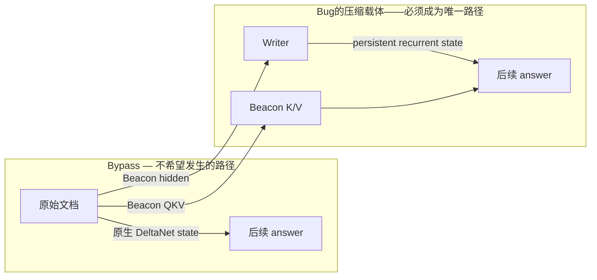
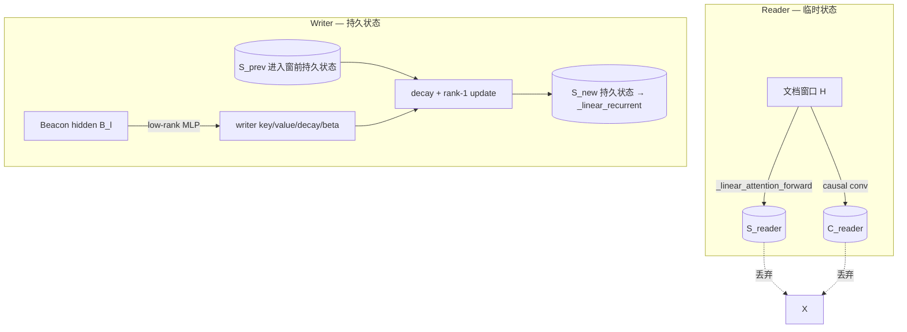
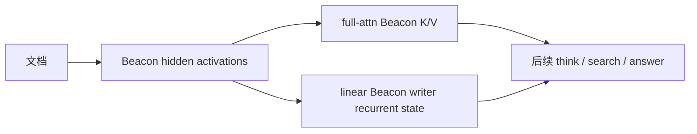

# Beacon Reader / Writer 架构流程

> 本文档聚焦 Qwen3.5 混合架构上 `Activation Beacon` 压缩中 **Reader** 与
> **Writer** 的实现逻辑与完整运行流程。基于 `search_comp/models/beacon_qwen3.py`
> 当前真实代码撰写（2026-09-22）。算法背景、可证伪不变量与完整训练/评测流程分别见
> `SEARCH_AGENT_BEACON_METHOD.md` 与 `WORKFLOW.md`。

一句话：**Reader 读文档、读完即弃；Writer 用 Beacon 把文档的“摘要”写回固定尺寸
的持久循环状态。** 配合 full-attention 层只持久化 Beacon K/V，两者共同保证后续
生成只能经 Beacon 压缩载体引用检索文档，不存在原始文档旁路。

---

## 1. 为什么需要 Reader / Writer

Qwen3.5-2B 是混合 decoder：24 层里 6 层 `full_attention`（标准 QKV 缓存），其余
18 层 `linear_attention`（GatedDeltaNet，固定尺寸循环状态）。

- **full-attention 层**：历史以 K/V 序列缓存，长度随上下文增长 → 需要把文档 K/V
  压缩成 Beacon K/V。
- **linear-attention 层**：历史以**固定尺寸 matrix state + 短因果卷积 state** 持有
  → 固定尺寸不代表“不含原始文档信息”。若压缩窗口结束后直接保留原生状态，后续
  token 仍能从该状态读到原始文档，形成旁路：



因此两类层都需要**严格的压缩边界**，Reader / Writer 是 linear 层实现边界的两个角色。

---

## 2. 总体运行流程

```mermaid
flowchart TD
    Q[Question + Search 指令] --> M[Qwen3.5 generation]
    M -->|缺少知识| SE[&lt;search&gt;...&lt;/search&gt;]
    SE --> R[BM25 检索器]
    R --> INF[&lt;information&gt; 文档 &lt;/information&gt;]
    INF --> SEG[记录文档 token 为 regions]
    SEG --> MEM[_Qwen3BeaconMemory 窗口状态机]
    MEM --> FW=[full-attn: Beacon K/V]
    MEM --> LW=[linear-attn: Beacon writer recurrent state]
    FW --> M
    LW --> M
    M -->|仍缺证据| SE
    M -->|足够| ANS[&lt;answer&gt;...&lt;/answer&gt;]
```

`BeaconQwen3_5ForCausalLM.forward` 驱动 `_Qwen3BeaconMemory`。主循环
`_beacon_forward()`（`beacon_qwen3.py:708`）：

```text
prepare()      # 全序列 + regions → 切成 keep / compress 交替 segment
  while not finish:
      step()              # 切一个窗口（含追加的 beacon token）
      _native_forward()   # 逐层前向
          full_attention 层 → BeaconQwen3Attention
          linear_attention 层 → Reader(_linear_attention_forward) + Writer
      update_memory()     # full-attn 层选择提交 beacon K/V 或全量 K/V
  output()                # 汇总跨窗口累积的 loss
```

---

## 3. 窗口状态机：keep / compress 分段

`prepare()`（`beacon_qwen3.py:302`）把序列在 token 空间切成片段。给定文档区间
`regions = [(s_1,e_1), (s_2,e_2), ...]`：

```text
[(0, s_1,      keep),
 (s_1, e_1,    compress),
 (e_1, s_2,    keep),
 (s_2, e_2,    compress),
 ...
 (last_end, L, keep)]
```

`step()`（`beacon_qwen3.py:323`）按 `beacon_window` 切当前窗口，并决定：

- **keep 段**：整窗口 K/V 全部保留，`beacon_size=0`，`store="cache"`；
- **compress 段**：满窗口追加 `window//ratio` 个 beacon；尾部不足一片时按
  `max(1, ceil(remaining/ratio))` 生成（`M-3` 保证任意长度文档都被压缩），
  `store="beacon"`。

窗口 token 从 `[d_1..d_D]` 扩展为 `[d_1..d_D, b_1..b_B]`，Beacon 用虚拟 id
`vocab_size`，`_step_beacon_indices` 同步标记每个位置是普通 token 还是 Beacon：

```text
[0, 0, ..., 0, 1, 1, ..., 1]
```

`beacon_pos="intersect"` 时（`beacon_qwen3.py:365`）改为在 chunk 内每 `ratio` 个
token 后插入一个 beacon（见 `beacon_intersect_order`），掩码保证 chunk 内保留完整
因果可见性。

---

## 4. Full-attention 层：Beacon 自注意力（`BeaconQwen3Attention`）

这是 Writers 的输入来源之一，也是并行于 linear Writer 的另一条压缩载体。

- **分区投影**：普通 token 用预训练 `q/k/v/o_proj`，Beacon 位置用独立可训练
  `beacon_{q,k,v,o}_proj`，`torch.where(bi==0, original, beacon)` token 级切换
  （`_qkv`，`beacon_qwen3.py:135`）。`beacon_param` 控制哪些投影独立，默认 `q k v`。
  注意 Qwen3.5 的 `q_proj` 同时输出 query 与 gate，gate 随 query 一并切换。
- **RoPE 前缓存**：持久 cache 保存 RoPE 之前的 K/V，每个窗口把 `past + current`
  整体重施加 mRoPE（`_beacon_forward`，`beacon_qwen3.py:226`），query 只用末尾
  `cur_len` 位置。
- **提交**（`update_memory`，`beacon_qwen3.py:407`）：compress 窗口只 `slice` 出
  beacon K/V 进入持久 cache；keep 窗口全量追加。原始文档 K/V 只存在于当前窗口内部，
  窗口结束即丢弃。

```mermaid
sequenceDiagram
    participant M as _Qwen3BeaconMemory
    participant A as BeaconQwen3Attention
    participant C as _cache[layer]
    M->>A: hidden, mask, past(4元组)
    A->>A: _qkv 按 beacon 切换 q/k/v 投影
    A->>A: cat(past_key, cur_key) → 整体 mRoPE
    A->>A: causal softmax attention * sigmoid(gate)
    A-->>M: new_past = 增量 RoPE前 (key,value,bs,idx)
    M->>M: store==beacon ? 只取 beacon K/V : 全取
    M->>C: concat 进持久 cache
```



---

## 5. Linear-attention 层：Reader（读文档）

`_linear_attention_forward()`（`beacon_qwen3.py:661`）是**显式、可微分**的
GatedDeltaNet 前向，彻底摆脱 HuggingFace `DynamicCache` 的隐式跨窗口状态：

```text
P = in_proj_qkv(H)
P_context = concat(C_prev, P)              # causal conv 左上下文
Mixed = SiLU(DepthwiseCausalConv(P_context))
[Q, K, V] = split(Mixed)
beta = sigmoid(in_proj_b(H))
g = -exp(A_log) * softplus(in_proj_a(H) + dt_bias)
[O, S_reader] = GatedDeltaRule(Q, K, V, g, beta, initial_state=S_prev)
O = out_proj(gated_rmsnorm(O, in_proj_z))
```

产出 `reader_recurrent`（`next_recurrent`）与 `reader_conv`（`next_conv`）两个临时状态。

**关键在于是“临时”**（`_native_forward`，`beacon_qwen3.py:587-599`）：

```text
keep 段:      initial = previous_recurrent            # 直接继续累积
compress 段:  initial = previous_recurrent.clone()    # 拷贝一份当初始态，读完丢弃
```

`clone()` 保证原始文档窗口对原生状态 `previous_recurrent` **不产生 in-place 污染**。
Reader 读完文档，Beacon 能读到文档信息，但原生状态不提交。

---

## 6. Linear-attention 层：Writer（写回持久状态）

### 6.1 触发与输入

在 compress 窗口完成该层 attention residual + MLP 后，取该层 Beacon 位置的输出隐藏
状态（`beacon_qwen3.py:605-614`）：

```text
B_l = hidden[:, _step_beacon_indices.bool()]           # beacon 位置隐状态
_linear_recurrent[idx] = writer(B_l, previous_recurrent)   # 写回持久状态
_linear_conv.pop(idx, None)                            # 清空卷积尾状态
```

`B_l` 已融合当前文档窗口、历史 keep/Beacon memory、该层 reader 输出与 MLP —— writer
**不直接读原始 token state，只读 decoder 形成的 Beacon 激活**。

### 6.2 低秩参数化（`BeaconLinearStateWriter`，`beacon_qwen3.py:40`）

```text
Z = Up(SiLU(Down(LayerNorm(B_l))))      # hidden_size → rank → num_heads*(k+v+decay+beta)
[writer_key, writer_value, writer_decay, writer_beta] = split(Z)
```

`Down: hidden_size → rank`（`beacon_linear_writer_rank`，默认 128）是低秩瓶颈，writer
因此可训练且参数量可控。初始时 `up.bias` 置零、decay bias 段填 `4.0`：
`sigmoid(4.0)≈0.982`，让 writer 一开始尽量保持状态稳定。

### 6.3 状态更新（FP32，顺序叠加每个 beacon）

```text
k_b = L2Normalize(writer_key_b)
v_b = writer_value_b
d_b = sigmoid(writer_decay_b)
beta_b = sigmoid(writer_beta_b)

S <- d_b * S                       # decay
p_b = S^T k_b                      # 读预测
u_b = beta_b * (v_b - p_b)         # 误差加权学习
S <- S + k_b * u_b^T               # rank-1 更新

最终 S 成为该 linear layer 新的持久状态 _linear_recurrent[idx]
```

初始 `S` 是**压缩窗口进入前**的持久状态（不是吸收过文档的 `S_reader`）；不存在则
全零。整个叠加以 FP32 维护，降低长序列累积的数值风险。

### 6.4 卷积状态处理

compress 窗口结束即 `delete _linear_conv[idx]`：卷积尾状态直接含有最近若干 projected
token，若保留会明确残留原始文档或 Beacon 邻 token。因此下一段从零卷积左上下文开始，
仍可通过 writer recurrent state 与 full-attention Beacon K/V 使用压缩记忆 —— 这是为
严格边界接受的局部连续性折中。

**keep 窗口**相反：其 token 本就允许完整保留，reader recurrent 与 conv 状态都直接提交
（`beacon_qwen3.py:612-614`）。



---

## 7. 一个压缩窗口的完整逐层过程

设窗口含 `D` 个文档 token、`B` 个 Beacon，一次 `_native_forward()`：

```text
1. Embedding
   document ids → original token embedding
   beacon virtual ids → beacon_embed_tokens（初始化自 EOS，可训练）

2. For layer l = 1 .. N
   a. input layer norm

   b1. if full_attention:
       普通/Beacon 分区投影 → cat 持久 K/V → 整体 mRoPE + causal attention
       保留当前窗口增量 K/V（RoPE 前）暂未提交

   b2. if linear_attention:
       initial = previous_recurrent           # keep：直接续
       initial = previous_recurrent.clone()   # compress：reader 临时拷贝
       run 显式 causal conv + GatedDeltaNet reader → 临时 reader_recurrent/conv

   c. attention residual

   d. post-attention norm + MLP residual

   e. if linear_attention and 当前窗口是 compress:
       beacon_hidden = hidden[beacon_mask]
       writer(beacon_hidden, pre-window persistent state) → commit 持久状态
       丢弃临时 conv 状态

   f. if linear_attention and 当前窗口是 keep:
       commit reader recurrent + conv 状态

3. final model norm + LM head

4. full_attention memory commit（由状态机统一执行）
   compress: 只追加 Beacon K/V；keep: 追加全部 K/V

5. loss 累积（只对非 -100 位置，即生成片段；文档/beacon 为 -100）
```

linear writer 在每个 linear layer 内**立即提交**该层状态；full-attention K/V 在整个
模型窗口前向完成后由状态机**统一选择并追加**。

---

## 8. 压缩边界后的严格不变量

对任意已完成压缩的 `<information>` 窗口，持久 memory 必须满足：

```text
M_persistent = {
    full_attention: Beacon K/V only,
    linear_attention: writer recurrent state only,
    convolution: 无该压缩窗口的任何状态
}
```

**不存在**：文档 token 的 full-attention K/V、文档窗口产生的原生 GatedDeltaNet final
state、窗口尾部的因果卷积 state、HuggingFace `DynamicCache` 形式的隐藏旁路。

因此从压缩窗口到后续生成的计算图只能经过：



---

## 9. 训练时梯度如何到达 Writer

文档与 Beacon 位置均为 `-100`，没有直接 LM loss。梯度经后续 answer loss 传播：

```text
answer loss
  -> 后段 linear-attention 输出
  -> 持久 writer recurrent state
  -> BeaconLinearStateWriter
  -> Beacon hidden states
  -> 文档 reader 激活
```

所以 Beacon 表示学习的是**“对后续 reasoning/search/answer 有用的信息”**，而非重建
全部文档。测试 `test_linear_writer_receives_gradient_from_post_compression_tokens`
验证了压缩后 token 的 loss 能到达 linear writer。LoRA 训练时 `beacon*` 参数会被重新设
为 `requires_grad=True`，全量训练。

---

## 10. 配置的真实语义（Reader/Writer 相关）

| 参数 | 作用 |
| --- | --- |
| `beacon_window` | 文档/keep 段单次处理窗口长度 |
| `beacon_ratio` | 每约 r 个原始文档 token 生成 1 个 Beacon |
| `beacon_param` | Beacon 独立使用哪些 full-attention 投影（默认 `q k v`） |
| `beacon_pos` | `append`（窗口尾追加）或 `intersect`（chunk 内每 ratio 插入） |
| `beacon_linear_writer_rank` | linear state writer 低秩瓶颈，控制参数量与表达力 |
| `beacon_embed_init` | Beacon embedding 从 EOS / BOS 初始化 |

---

## 11. 一句话总结

Reader 在压缩窗口内**临时**读完检索文档后即弃，Writer 只从 Beacon 激活经低秩网络重建
**固定尺寸的持久循环状态**；配合 full-attention 层只提交 Beacon K/V，后续 reasoning、
继续搜索与回答使用的统一是 Beacon 压缩记忆，彻底杜绝原始文档在 Qwen3.5 线性注意力
状态中的旁路。